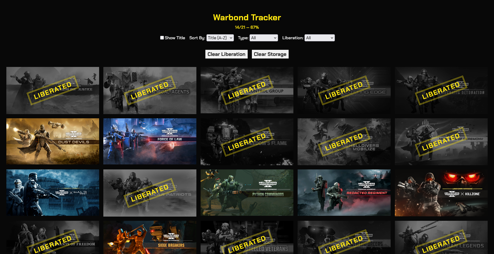

<div align="center">

# Warbond Tracker

Track your Helldivers 2 Warbond completion.



</div>

## 📋 Installation

<details open>
<summary><strong>GitHub Pages</strong></summary>
<br>

Check it out [here](https://johnarp.github.io/warbond-tracker)

</details>

<details>
<summary><strong>Open in Your Browser</strong></summary>
<br>

1. Clone the repository
    ```powershell
    git clone https://github.com/johnarp/warbond-tracker.git
    ```
2. Run a local server
    ```powershell
    # Python 3
    cd warbond-tracker
    python -m http.server 3000
    ```
3. Open your browser and go to [http://localhost:3000](http://localhost:3000)

</details>

## ✨ Version

See [Releases](https://github.com/johnarp/warbond-tracker/releases) for the latest release.

See [CHANGELOG](CHANGELOG.md) for updates.

## 📜 License

[MIT License](LICENSE)