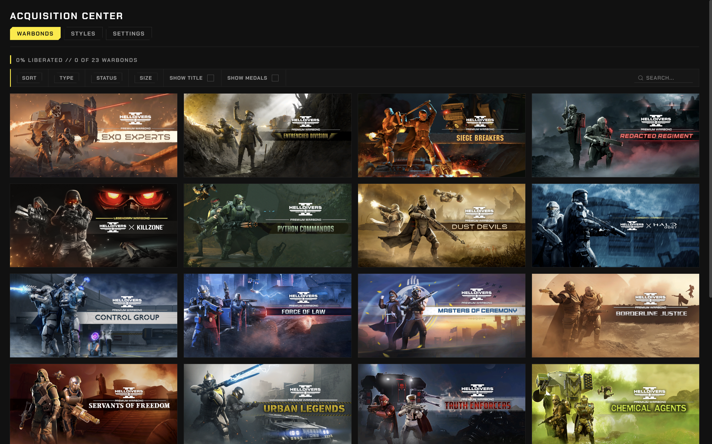
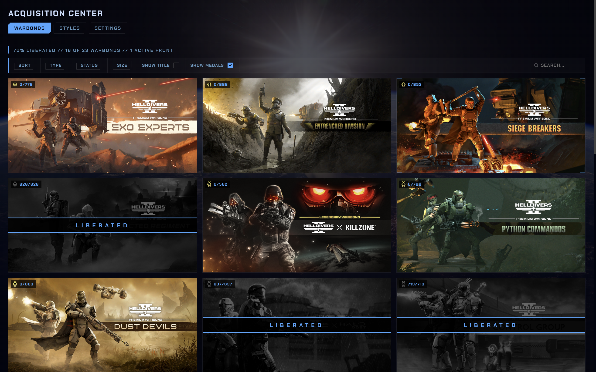

<div align="center">


# Warbond Tracker

Track your Helldivers 2 Warbond completion.

[](./LICENSE)


</div>

## ✨ Features

- Mark Warbonds as Liberated, Liberating, or Unliberated
- Track Warbonds using Medals
- Customize using multiple color or image themes
- localStorage persistence with export, import, and clear

## 📸 Preview

<div style="display: flex; gap: 10px; justify-content: center">
    
    
</div>

## 🚀 Installation

The easiest way to access is going to the website: [https://johnarp.github.io/warbond-tracker/](https://johnarp.github.io/warbond-tracker/)

Or, if you wish to use locally, here are the steps:

### 1. Downloading the Code

Clone the repository through a terminal, such as Command Prompt or Powershell:

```
git clone https://github.com/johnarp/warbond-tracker
cd warbond-tracker
```

### 2. Running the App

Run the command:

```
python -m http.server 3000
```

### 3. Using the App

Open [http://localhost:3000](http://localhost:3000) in a web browser.

## ⚠️ Known Issues

- Warbond size changing on mobile

## 🗺️ Roadmap

- OLED changes mobile navigation color to the background color
- Community Liberation tracking with live updates, displays global Liberation percentage and more
    - Would use Vercel, Redis, and Pusher
- Super Super Styles that fundamentally change the site
- [REDACTED] Super Super Style with black bars covering lots of stuff
- Add more to profiles, such as name, titles (eg. Space Chief Prime), avatars, and more
- Improve Liberating effect
- Improve Warbond title look
- Custom sorting order
- Pinning Warbonds
- Dragging Warbonds
- Selecting Warbonds with a special menu for applying operations to all selected
- Sound effects
- Music
- Keyboard inputs, eg. WASD to navigate warbonds, [] to navigate tabs, etc.
- Stratagem keyboard inputs, eg. hold CTRL to open the menu, enter arrow sequence
- Different view layouts, eg. grid, list, embed mode (can fit on very small displays)
- Undo/redo changes
- View changelog natively in the app
- Random Warbond picker

## 📄 License

This project is licensed under the [MIT License](./LICENSE).

## ⚖️ Legal

Warbond Tracker is an unofficial project and is not affiliated with, endorsed by, or associated with Arrowhead Game Studios AB or Sony Interactive Entertainment LLC in any way.

HELLDIVERS™ 2 assets, images, and related media included in this project are the property of Arrowhead Game Studios and/or Sony Interactive Entertainment and are not covered by the MIT License.