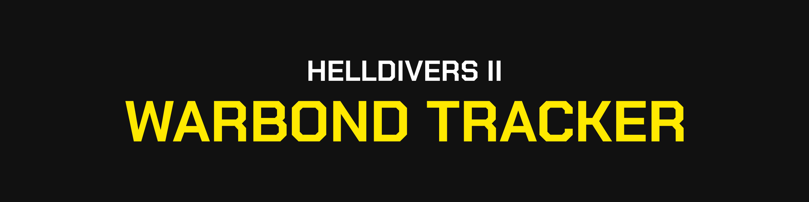
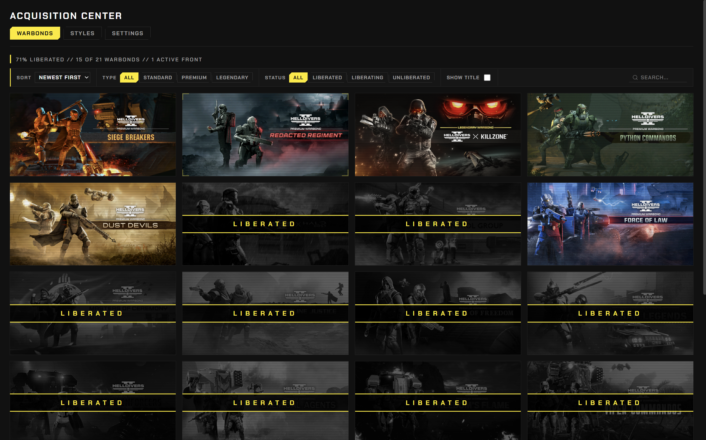

<div align="center">



# Warbond Tracker

Track your Helldivers 2 Warbond completion.

</div>

## Preview



## Features

- Mark Warbonds as **Liberated**, **Liberating**, or **Unliberated**
- Filter by type (Standard, Premium, Legendary) and Liberation status
- Sort by release date or title
- Search by name or alias
- Multiple colour themes
- Import / export progress as JSON
- No backend or accounts

## Usage

The easiest way is the live site:

**[johnarp.github.io/warbond-tracker](https://johnarp.github.io/warbond-tracker)**

Or, run it locally with any static server:

```
git clone https://github.com/johnarp/warbond-tracker.git
cd warbond-tracker
python -m http.server 3000
```

Then open [http://localhost:3000](http://localhost:3000)

## Changelog

See [CHANGELOG](CHANGELOG.md) or [Releases](https://github.com/johnarp/warbond-tracker/releases).

## License

Source code is licensed under the [MIT License](LICENSE)

## Legal

HELLDIVERS™ 2 assets, images, and related media included in this project are the property of Arrowhead Game Studios AB and/or Sony Interactive Entertainment LLC and are not covered by the [MIT License](LICENSE). This project is not affiliated with or endorsed by Arrowhead Game Studios or Sony Interactive Entertainment.